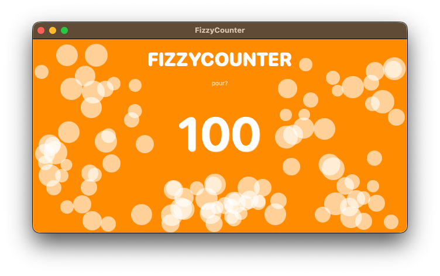
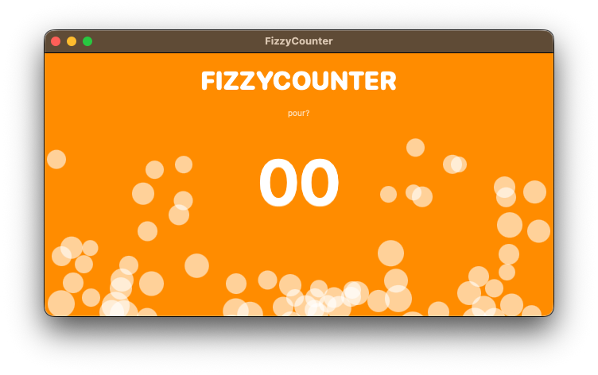

# FizzyCounter

A playful macOS counter app built with SwiftUI. Each tap on the counter spawns a “bubble” that floats to a random safe Y-position—avoiding the title and counter UI—and, once you’ve tapped a configurable max count, lets you “pour” them all out with a satisfying drain animation.

---

## 🚀 Features

- **Click-to-increment**: Tap the big counter to increment and spawn a bubble.  
- **Smart bubble placement**: Bubbles stop at random heights, never overlapping your title or counter.  
- **Max-count cap**: Configure how many bubbles you can spawn before needing to pour.  
- **Pour button**: Drains all bubbles with size-based fall speeds.  
- **Editable title**: Change the app’s title up to a configurable character limit.  
- **Customizable theme**: Adjust colors, fonts, and max values in one place.

---

## 📷 Screenshots



## 💻 Requirements

- **macOS** 14.0 or later  
- **Xcode** 15 or later  
- **Swift** 5.8+  
- **SwiftUI** framework  

---

## 🔧 Installation

1. Clone the repo:  
   ```bash
   git clone https://github.com/yourusername/fizzycounter.git
   cd fizzycounter
